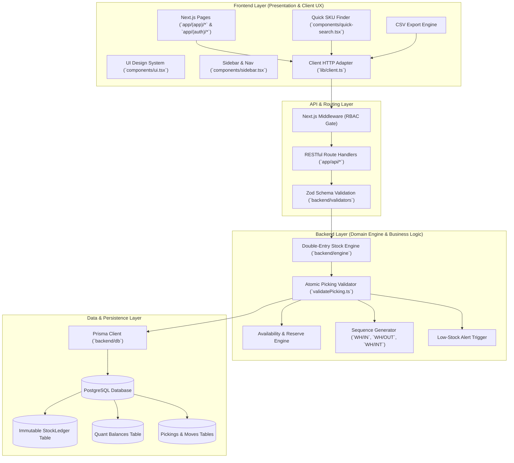
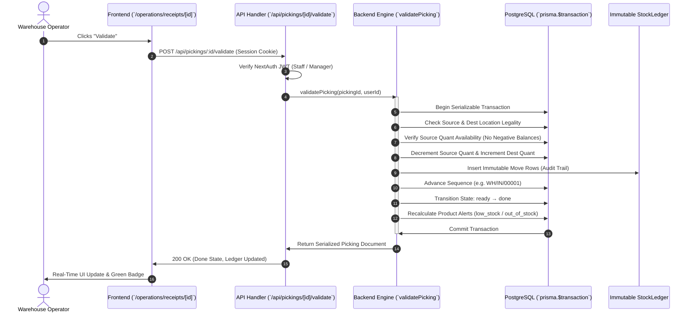

# StockSense — System Architecture & Layer Alignment

> **A clear architectural separation between Frontend (presentation, UX, design system) and Backend (double-entry stock engine, database, immutable ledger, and transaction guarantees).**

---

## 🏛️ High-Level System Architecture



---

## 📂 Repository Directory Alignment

The codebase is organized into clear functional layers:

```
odoo/
├── frontend/                     # 🎨 FRONTEND ARCHITECTURE GATEWAY
│   ├── components/               # UI components, tables, search, navigation
│   └── index.ts                  # Client types, adapters, and UI exports
│
├── backend/                      # ⚙️ BACKEND ARCHITECTURE GATEWAY
│   ├── engine/                   # Core double-entry stock transactions
│   │   ├── validatePicking.ts    # Single-transaction validation & ledger commit
│   │   ├── availability.ts       # Stock reservation & negative balance prevention
│   │   ├── sequence.ts           # Automatic document sequence numbering
│   │   ├── alerts.ts             # Low-stock recalculation
│   │   └── rules.ts              # ERP location movement validation
│   ├── db/                       # Database client wrapper
│   │   └── index.ts              # Prisma singleton
│   ├── validators/               # Input validation
│   │   └── index.ts              # Zod schemas for pickings and master data
│   ├── services/                 # Business services
│   │   └── index.ts              # Auth, serialization, HTTP utilities
│   └── index.ts                  # Unified backend export
│
├── app/                          # 🌐 FULL-STACK APPLICATION RUNTIME (Next.js)
│   ├── (app)/                    # Authenticated workspace routes
│   │   ├── dashboard/            # Executive KPI dashboard & low-stock banner
│   │   ├── operations/           # Receipts, Deliveries, Transfers, Adjustments,
│   │   │                         # Kanban board, and Move History
│   │   ├── products/             # Product catalogue & location quants
│   │   ├── settings/             # Warehouse, location, and partner master data
│   │   └── profile/              # Operator profile & audit trail info
│   ├── (auth)/                   # Authentication screens
│   │   ├── login/                # Two-panel login with demo credentials
│   │   ├── signup/               # Operator self-service registration
│   │   └── reset/                # OTP recovery flow
│   └── api/                      # REST API endpoint handlers
│       ├── pickings/             # Draft, confirm, pick, pack, validate, cancel
│       ├── products/             # CRUD and location quant breakdown
│       ├── ledger/               # Append-only double-entry audit query
│       ├── master/               # Master data entities
│       └── auth/                 # NextAuth session handlers
│
├── prisma/                       # 🗄️ DATABASE & ORM DEFINITIONS
│   ├── schema.prisma             # Entity models (StockLedger, Quant, Picking, etc.)
│   ├── migrations/               # Versioned SQL migrations
│   └── seed.ts                   # Idempotent benchmark seed script
│
├── components/                   # Reusable visual UI elements & design tokens
├── lib/                          # Underlying core library implementation
└── scripts/                      # Developer smoke tests & CLI scripts
```

---

## 🔄 The Life of a Stock Transaction (Frontend → Backend)

To illustrate the clean separation between frontend interaction and backend processing, consider the path of a **Receipt Validation**:



---

## 🛡️ Architectural Guarantees

1. **Zero Phantom Quantities**:
   - Stock counts are never stored as arbitrary modifiable fields.
   - Company on-hand is calculated strictly as:
     $$\text{On-Hand} = \sum_{\text{location} \in \{\text{internal}, \text{production}\}} \text{Quant}(\text{product}, \text{location})$$

2. **Immutable Audit Trail**:
   - The `StockLedger` table has no `UPDATE` or `DELETE` API endpoints.
   - Any physical discrepancy (breakage, theft, loss) is resolved by generating a formal **Inventory Adjustment document** that moves stock to/from the virtual `inventory_loss` location.

3. **Atomic State Machine**:
   - Picking status transitions (`draft` → `waiting` → `ready` → `done` or `canceled`) cannot skip validation checks.
   - Overselling or moving unavailable stock throws an `InsufficientStockError`, returning a structured 400 response with available vs requested quantities.
